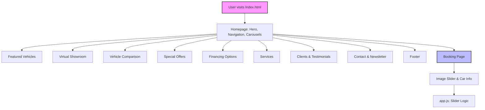

# Soul On Wheels - Car Dealership Website

Welcome to **Soul On Wheels**, a modern, responsive car dealership website for showcasing luxury vehicles, offering car services, rentals, and more. This project is built with HTML, CSS, and JavaScript, providing a seamless and visually appealing user experience.

---

## 🚗 Project Overview
Soul On Wheels is a web application designed for car dealerships to:
- Display featured vehicles and virtual showrooms
- Allow users to compare vehicles
- Offer car deals, services, and rental options
- Provide special offers and financing information
- Collect user inquiries and newsletter subscriptions

---

## 🌟 Features
- **Responsive Design:** Works on all devices
- **Hero Section:** Eye-catching introduction with call-to-action
- **Image Carousel:** Showcases luxury cars
- **Featured Vehicles:** Highlights top models
- **Virtual Showroom:** Interactive car exploration
- **Vehicle Comparison:** Side-by-side spec comparison
- **Special Offers & Financing:** Promotions and flexible payment options
- **Services:** Car deals, maintenance, and rentals
- **Client & Testimonial Sections:** Builds trust with real feedback
- **Contact & Newsletter:** Easy communication and updates
- **Booking Page:** Interactive car slider for detailed viewing

---

## 📁 Folder Structure
```
Car-DealerShip-Website/
├── app.js                  # Slider logic for booking page
├── booking.html            # Car booking/slider page
├── css/
│   ├── style.css           # Additional styles
│   └── Website_StyleSheet.css # Main website styles
├── images/                 # All images (cars, clients, services, etc.)
├── Index.html              # Main landing page
├── js/
│   ├── carousel.js         # (Optional) Carousel logic
│   └── newsletter.js       # (Optional) Newsletter logic
└── LICENSE
```

---

## 🛠️ Setup & Usage
1. **Clone the repository:**
   ```bash
   git clone <repo-url>
   ```
2. **Open `Index.html` in your browser** to explore the website.
3. **Navigate to `booking.html`** for the interactive car slider.
4. No backend/server setup required (static site).

---

## 🖼️ Project Flow Diagram



---

## 🎨 Styling & Design
- Uses modern gradients, shadows, and responsive layouts
- Main styles in `css/Website_StyleSheet.css`
- Custom fonts and icons for a premium look

---

## 🤝 Contributing
Pull requests are welcome! For major changes, please open an issue first to discuss what you would like to change.

---

## 📄 License
This project is licensed under the MIT License. See the [LICENSE](LICENSE) file for details. 